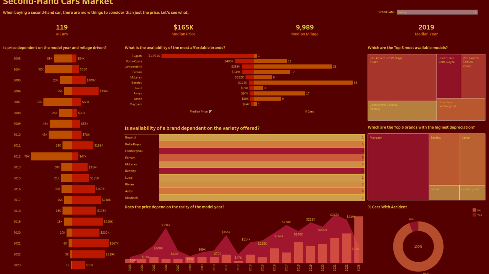
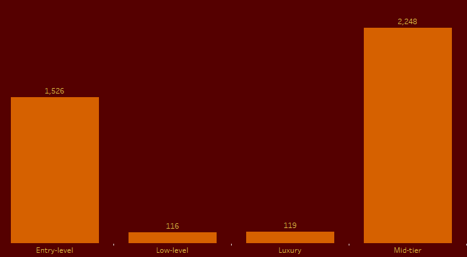
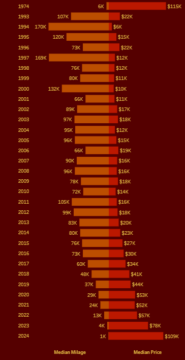
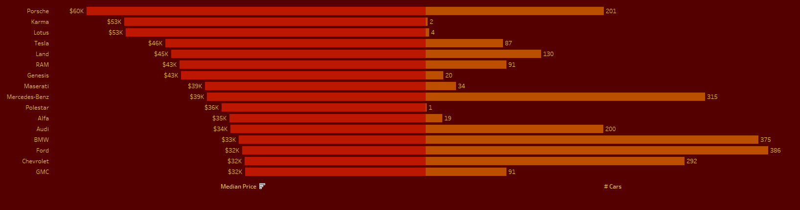
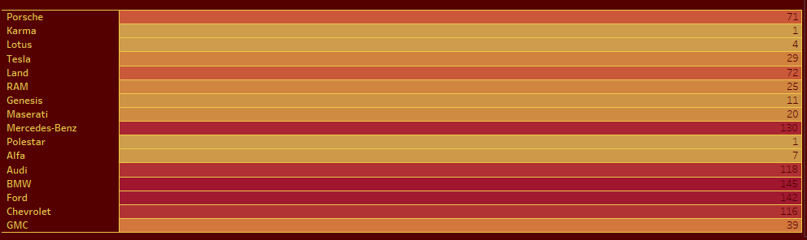
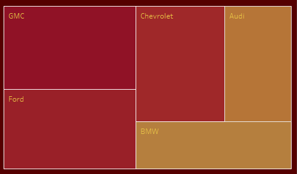

# Navigating the Second-Hand Car Market: A Data-Driven Approach #

  

The second-hand car market is a vibrant and growing industry where people can find different car brands that fit their budget and needs. With so many options available, it can become confusing to decide which one to go for. So, let's take a data-driven approach to identify the best car brands and the ones to avoid.

To start with, I created four categories based on the median price of each brand.

1. Luxury: Median Brand Price > $60,000
2. Mid-Tier: Median Brand Price > $30,000 and <= $60,000
3. Entry-Level: Median Brand Price > $15,000 and <= $30,000
4. Low-Level: Median Brand Price <= $15,000

  

I'll focus my analysis on mid-tier car brands as it is the largest segment and try to understand the segment better by answering a series of questions.

## Is the Price Dependent on the Model Year and the Milage Driven? ##
By intuition, it makes sense that older the car is, the cheaper it'll be.

  

Surprisingly, the price doesn't depend on the model year of the car, at least directly. Rather, the milage driven proves to be a more important factor. This explains why the price of 1974 model year cars in the above chart is much higher compared to cars of other model years.

## Does price depend on the rarity of the model year? ##

  

Although, price of a car doesn't directly depend on the model year, we see a price dependence on the rarity of the model year especially for years before 1997. This explains why cars of model year 1993 and 1996 have a high price despite having a high milage driven.

## Which are the most affordable brands and are they easily available in the market? ##

  

For most brands, as expected, there is an inverse relation between price and availability. But there are outliers like Porsche and Mercedes-Benz which have a high price and high availability.

  

It becomes clear from the above chart the reason that Porsche and Mercedes-Benz have a high availability is because of high number of model offerings.

## Which brands have a high depreciation? ##
Depreciation becomes an important factor for customers who plan to resell the car after buying. If the depreciation is high the return will be less when they resell the car.

  

GMC, Ford, Chevy, Audi, and BMW are the top 5 brands with the highest depreciation. Coincidently, they are also the most affordable brands in the mid-tier segment.

## Conclusion ##
1. In the mid-tier segment, price is more strongly influenced by mileage driven than by the model year. Surprisingly, older cars can sometimes command higher prices, especially if they are rare or have low mileage.
2. There is generally an inverse relationship between price and availability for most brands. However, brands like Porsche and Mercedes-Benz are notable exceptions, maintaining high prices despite high availability due to their diverse model offerings.
3. The most affordable brands in the mid-tier segment (GMC, Ford, Chevy, Audi, and BMW) also tend to have the highest depreciation rates. This suggests that while these brands may be more accessible initially, they may offer less value retention for buyers planning to resell in the future

[Tableau Public Dashboard Link](https://public.tableau.com/app/profile/praveen.satya.r.v/viz/SecondHandCarSales/Second-HandCarsMarketDashboard) |
[Kaggle Dataset Link](https://www.kaggle.com/datasets/taeefnajib/used-car-price-prediction-dataset/data)